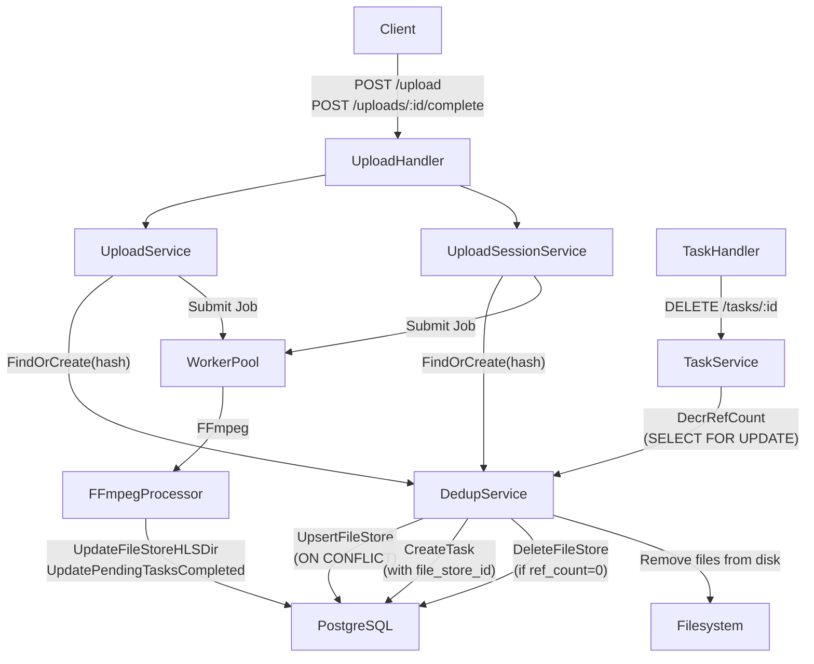
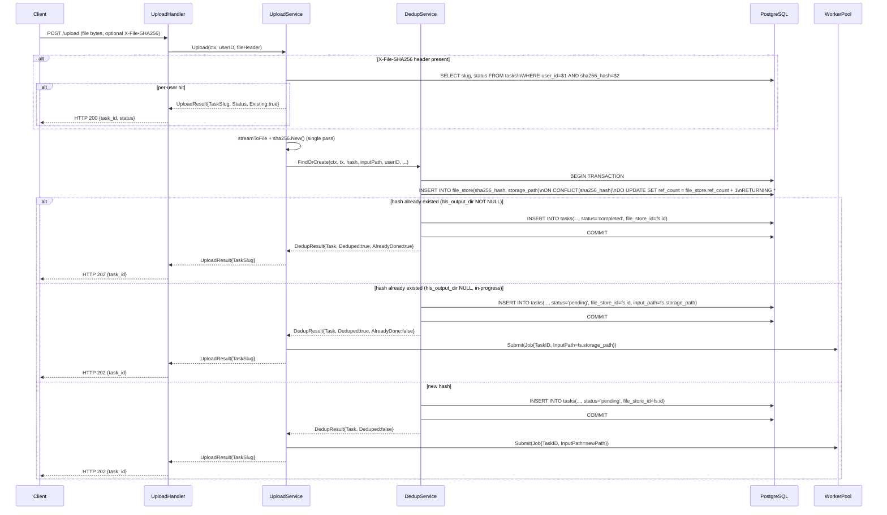
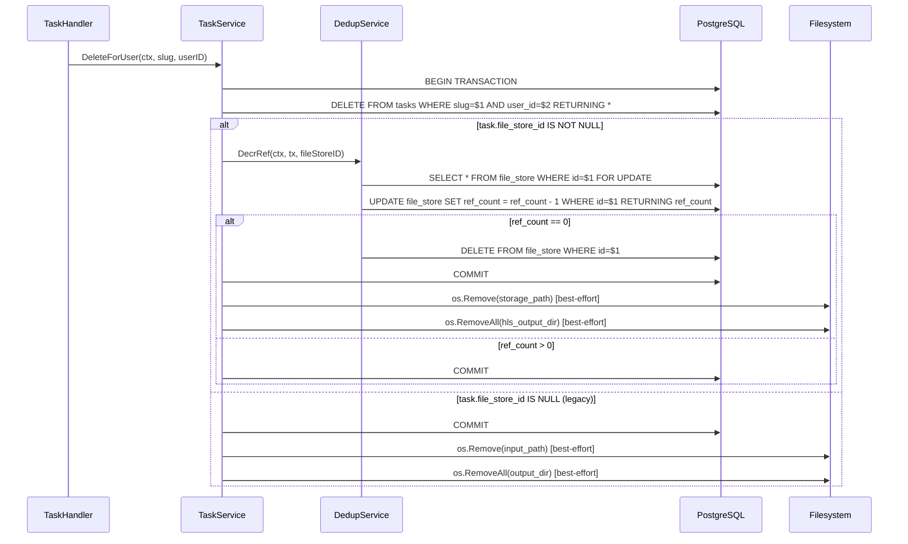
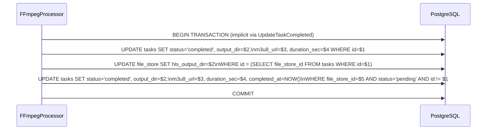

# Design Document: Cross-User File Deduplication

## Overview

本设计为 videoFlowConvert 增加跨用户文件去重能力。核心思路是引入一张 `file_store` 表作为物理文件的注册中心，通过 SHA-256 哈希识别相同内容，用引用计数管理文件生命周期。每个用户仍拥有独立的 `tasks` 行，用户体验不受影响；去重逻辑对 API 消费者完全透明，不泄露其他用户的文件存在性。

### 设计目标

- **存储节约**：相同内容的物理文件只保存一份，HLS 转码结果只生成一份。
- **透明性**：API 响应结构对所有用户完全一致，不暴露去重状态。
- **并发安全**：通过 `INSERT ... ON CONFLICT DO UPDATE` 和 `SELECT FOR UPDATE` 防止竞态条件。
- **向后兼容**：无 `file_store_id` 的历史 task 继续走原有删除路径。

### 不在范围内

- 跨进程/跨节点的分布式锁（单 PostgreSQL 事务已足够）。
- 客户端强制去重（客户端 per-user 快速跳过是可选优化）。
- 已有 task 的数据迁移（历史数据保持 `file_store_id = NULL`）。

---

## Architecture

### 系统组件图



### 数据流：单次上传（POST /upload）



### 数据流：任务删除（DELETE /tasks/:id）



### 数据流：Worker 完成转码



---

## Components and Interfaces

### 新增组件：DedupService

`DedupService` 是本功能的核心协调器，封装所有与 `file_store` 表的交互。它不直接持有 `pgxpool.Pool`，而是接受 `pgx.Tx` 参数，让调用方（`UploadService`、`TaskService`）控制事务边界。

```go
// internal/service/dedup.go

package service

import (
    "context"
    "os"

    "github.com/jackc/pgx/v5"
    "github.com/jackc/pgx/v5/pgxpool"
    "github.com/rs/zerolog"

    "github.com/videoflow/videoconv/internal/db/sqlc"
)

// DedupService coordinates file_store upserts and ref_count management.
// All methods that mutate file_store accept a pgx.Tx so the caller controls
// the transaction boundary.
type DedupService struct {
    pg     *pgxpool.Pool
    logger zerolog.Logger
}

func NewDedupService(pg *pgxpool.Pool, logger zerolog.Logger) *DedupService {
    return &DedupService{pg: pg, logger: logger}
}

// FindOrCreateParams carries all inputs needed to upsert a file_store row
// and create the associated task row within a single transaction.
type FindOrCreateParams struct {
    Hash         string // hex-encoded SHA-256
    StoragePath  string // canonical on-disk path for the input file
    UserID       int64
    Slug         uuid.UUID
    OriginalName string
    FileSize     int64
}

// FindOrCreateResult is returned after the upsert+task-insert transaction.
type FindOrCreateResult struct {
    Task        sqlc.Task
    FileStore   sqlc.FileStore
    Deduped     bool // true if an existing file_store row was reused
    AlreadyDone bool // true if hls_output_dir was already set (transcoding complete)
}

// FindOrCreate atomically upserts a file_store row and inserts a task row
// within a single PostgreSQL transaction. It returns whether deduplication
// occurred and whether the transcoding is already complete.
func (s *DedupService) FindOrCreate(ctx context.Context, p FindOrCreateParams) (FindOrCreateResult, error)

// DecrRef decrements the ref_count of a file_store row within the provided
// transaction. If ref_count reaches 0, it deletes the file_store row and
// returns the paths to clean up from disk. The caller is responsible for
// committing the transaction and performing the disk cleanup after commit.
func (s *DedupService) DecrRef(ctx context.Context, tx pgx.Tx, fileStoreID int64) (storagePath, hlsOutputDir string, deleted bool, err error)

// FindByUserHash queries the current user's tasks for a matching sha256_hash.
// This is the per-user fast-skip path and deliberately does NOT query file_store.
func (s *DedupService) FindByUserHash(ctx context.Context, userID int64, hash string) (sqlc.Task, bool, error)
```

### 修改组件：UploadService

`UploadService` 增加对 `DedupService` 的依赖，并在 `Upload` 方法中：
1. 检查 `X-File-SHA256` 请求头（per-user 快速跳过）。
2. 流式写文件的同时计算 SHA-256（单次 pass）。
3. 调用 `DedupService.FindOrCreate` 完成事务性 upsert+task 创建。
4. 根据 `FindOrCreateResult.AlreadyDone` 决定是否提交 Worker 任务。

```go
// internal/service/upload.go (修改后签名)

type UploadService struct {
    queries *sqlc.Queries
    pg      *pgxpool.Pool   // 新增：用于开启事务
    pool    *worker.Pool
    dedup   *DedupService   // 新增
    cfg     *config.Config
    logger  zerolog.Logger
}

type UploadResult struct {
    TaskSlug uuid.UUID
    Status   string // 新增：让 handler 知道是否已完成（但不暴露给客户端）
}

func (s *UploadService) Upload(ctx context.Context, userID int64, fh *multipart.FileHeader) (UploadResult, error)
```

### 修改组件：UploadSessionService

`UploadSessionService.Complete` 方法修改为：
1. 计算已组装文件的 SHA-256。
2. 调用 `DedupService.FindOrCreate`。
3. 若 `Deduped=true`，删除临时文件；若 `Deduped=false`，将临时文件 rename 到 canonical path。

```go
// internal/service/upload_session.go (修改后签名)

type UploadSessionService struct {
    queries *sqlc.Queries
    pg      *pgxpool.Pool   // 新增
    pool    *worker.Pool
    dedup   *DedupService   // 新增
    cfg     *config.Config
    logger  zerolog.Logger
    mu      sync.Mutex
    locks   map[uuid.UUID]*sync.Mutex
}
```

### 修改组件：TaskService

`TaskService.DeleteForUser` 修改为：
1. 在事务中删除 task 行。
2. 若 `file_store_id` 非空，调用 `DedupService.DecrRef`（在同一事务内）。
3. 事务提交后，执行磁盘清理（best-effort）。

```go
// internal/service/task.go (修改后签名)

type TaskService struct {
    queries *sqlc.Queries
    pg      *pgxpool.Pool   // 新增
    dedup   *DedupService   // 新增
    logger  zerolog.Logger  // 新增：用于 WARN 日志
}
```

### 修改组件：FFmpegProcessor

`FFmpegProcessor.Process` 在 `UpdateTaskCompleted` 之后，额外执行：
1. 更新 `file_store.hls_output_dir`。
2. 批量将共享同一 `file_store_id` 的 `pending` tasks 更新为 `completed`。

```go
// internal/worker/ffmpeg.go (修改后 Process 方法)

type FFmpegProcessor struct {
    cfg     *config.Config
    queries *sqlc.Queries
    pg      *pgxpool.Pool   // 新增：用于批量更新事务
    rdb     *redis.Client
    logger  zerolog.Logger
}
```

### 修改组件：UploadHandler

`UploadHandler.Upload` 增加对 `X-File-SHA256` 请求头的读取，并在 per-user hit 时返回 HTTP 200（而非 202）。

```go
// internal/handler/upload.go (修改后)

func (h *UploadHandler) Upload(c echo.Context) error {
    userID, ok := mw.UserID(c)
    if !ok {
        return echo.NewHTTPError(http.StatusUnauthorized, "missing user")
    }
    // Per-user fast-skip: read header before touching the file body.
    if hash := c.Request().Header.Get("X-File-SHA256"); hash != "" {
        if res, found, err := h.svc.CheckUserHash(c.Request().Context(), userID, hash); err == nil && found {
            return OK(c, map[string]string{"task_id": res.TaskSlug.String(), "status": res.Status})
        }
    }
    fh, err := c.FormFile("file")
    if err != nil {
        return echo.NewHTTPError(http.StatusBadRequest, "file field required")
    }
    res, err := h.svc.Upload(c.Request().Context(), userID, fh)
    if err != nil {
        return MapError(err)
    }
    return Accepted(c, map[string]string{"task_id": res.TaskSlug.String()})
}
```

---

## Data Models

### 新增表：file_store

```sql
-- 000002_cross_user_dedup.up.sql

CREATE TABLE file_store (
    id             BIGSERIAL    PRIMARY KEY,
    sha256_hash    VARCHAR(64)  NOT NULL UNIQUE,
    storage_path   TEXT         NOT NULL,
    hls_output_dir TEXT,
    ref_count      INTEGER      NOT NULL DEFAULT 1 CHECK (ref_count >= 0),
    created_at     TIMESTAMPTZ  NOT NULL DEFAULT NOW()
);

CREATE INDEX idx_file_store_sha256 ON file_store(sha256_hash);
```

### 修改表：tasks

```sql
-- 000002_cross_user_dedup.up.sql (续)

ALTER TABLE tasks
    ADD COLUMN file_store_id BIGINT
        REFERENCES file_store(id) ON DELETE SET NULL,
    ADD COLUMN sha256_hash   VARCHAR(64);

CREATE INDEX idx_tasks_user_sha256 ON tasks(user_id, sha256_hash);
```

### 更新后的 sqlc 模型

```go
// internal/db/sqlc/models.go (新增 FileStore，Task 新增字段)

type FileStore struct {
    ID           int64              `json:"id"`
    Sha256Hash   string             `json:"sha256_hash"`
    StoragePath  string             `json:"storage_path"`
    HlsOutputDir pgtype.Text        `json:"hls_output_dir"`
    RefCount     int32              `json:"ref_count"`
    CreatedAt    pgtype.Timestamptz `json:"created_at"`
}

type Task struct {
    // ... 现有字段不变 ...
    FileStoreID  pgtype.Int8 `json:"file_store_id"` // 新增，nullable
    Sha256Hash   pgtype.Text `json:"sha256_hash"`   // 新增，nullable (legacy tasks)
}
```

### 迁移回滚

```sql
-- 000002_cross_user_dedup.down.sql

ALTER TABLE tasks
    DROP COLUMN IF EXISTS file_store_id,
    DROP COLUMN IF EXISTS sha256_hash;

DROP TABLE IF EXISTS file_store;
```

---

## Correctness Properties

*A property is a characteristic or behavior that should hold true across all valid executions of a system — essentially, a formal statement about what the system should do. Properties serve as the bridge between human-readable specifications and machine-verifiable correctness guarantees.*

### Property 1: SHA-256 哈希计算正确性

*For any* 字节序列，Upload Service 和 UploadSession Service 计算出的 SHA-256 哈希值应等于对相同字节序列调用标准库 `sha256.Sum256` 的结果。

**Validates: Requirements 2.1, 2.2, 10.1, 10.2**

### Property 2: 引用计数单调递增（并发安全）

*For any* N 个并发上传相同 SHA-256 哈希的请求，事务全部提交后 `file_store` 表中应恰好存在一行，且 `ref_count = N`。

**Validates: Requirements 1.3, 9.1**

### Property 3: 引用计数递减与任务删除原子性

*For any* 拥有 `file_store_id` 的 task，删除该 task 后，对应 `file_store` 行的 `ref_count` 应恰好减少 1；若 `ref_count` 降至 0，则该行应不再存在。

**Validates: Requirements 1.4, 5.1, 5.2, 5.5**

### Property 4: 去重任务继承已完成状态

*For any* `hls_output_dir` 非空的 `file_store` 行，上传相同哈希的文件后创建的新 task，其 `status` 应为 `completed`，`output_dir`、`m3u8_url`、`duration_sec` 应与 `file_store` 行中的值一致。

**Validates: Requirements 3.2, 4.2**

### Property 5: 去重任务继承进行中状态

*For any* `hls_output_dir` 为空的 `file_store` 行（转码进行中），上传相同哈希的文件后创建的新 task，其 `status` 应为 `pending`，`input_path` 应等于 `file_store.storage_path`。

**Validates: Requirements 3.3, 4.3**

### Property 6: API 响应结构一致性（防 Hash Confirmation Attack）

*For any* 上传请求（无论是否触发去重），HTTP 响应的状态码和 JSON body 结构应完全相同，且响应体中不应包含 `file_store_id`、`sha256_hash`、`deduplicated`、`cached` 或 `existing_task` 字段。

**Validates: Requirements 3.5, 4.5, 7.1, 7.2, 7.3, 7.4**

### Property 7: Per-User 哈希查询数据隔离

*For any* 用户 A 和哈希 H，即使用户 B 拥有哈希为 H 的 task，对用户 A 执行 per-user 哈希查询时，结果中不应包含用户 B 的任何 task 数据。

**Validates: Requirements 8.1, 8.4, 10.4**

### Property 8: Worker 完成后批量更新 pending tasks

*For any* 共享同一 `file_store_id` 的 N 个 `pending` tasks，当对应的 Worker 任务完成后，所有这些 tasks 的 `status` 应变为 `completed`，且 `output_dir`、`m3u8_url`、`duration_sec` 应与完成的 job 结果一致。

**Validates: Requirements 6.1, 6.2**

### Property 9: SHA-256 哈希存储在 tasks 行

*For any* 通过 Upload Service 或 UploadSession Service 创建的 task，`tasks.sha256_hash` 列的值应等于上传文件的 SHA-256 哈希。

**Validates: Requirements 10.1, 10.2**

---

## Error Handling

### 事务失败

| 场景 | 处理方式 |
|------|----------|
| `file_store` upsert 失败（序列化错误） | 返回 `model.ErrInternal`，不重试（Req 9.4） |
| task insert 失败（事务回滚） | 返回 `model.ErrInternal`，`file_store` 行因事务回滚不会留下孤儿行 |
| `ref_count` 递减失败 | 返回 `model.ErrInternal`，事务回滚，task 行不删除 |

### 磁盘操作失败

| 场景 | 处理方式 |
|------|----------|
| 物理文件删除失败（`ref_count` 已降至 0） | 记录 `WARN` 日志，返回成功（Req 5.4）；孤儿文件由运维定期清理 |
| `file_store` 行更新失败（Worker 完成后） | 记录 `ERROR` 日志，继续将原始 task 标记为 `completed`（Req 6.3） |
| SHA-256 计算 I/O 错误 | 返回 `model.ErrInternal`，不创建 task 行（Req 2.4, 2.5） |

### 并发竞态

| 场景 | 处理方式 |
|------|----------|
| 两个并发上传相同哈希 | `ON CONFLICT DO UPDATE` 原子处理，只有一个物理文件被写入 |
| 删除与上传并发（相同哈希） | 删除事务使用 `SELECT FOR UPDATE` 锁定 `file_store` 行，防止 `ref_count` 在新引用添加时降至 0（Req 9.3） |

### 向后兼容

历史 task（`file_store_id IS NULL`）在删除时走原有路径：直接删除 `input_path` 和 `output_dir`（Req 5.3）。

---

## Testing Strategy

### 单元测试

使用 `testify/mock` 或接口替换对 `sqlc.Queries` 和 `pgxpool.Pool` 进行 mock，覆盖以下场景：

- `DedupService.FindOrCreate`：新哈希、已存在且完成、已存在且进行中三条路径。
- `DedupService.DecrRef`：`ref_count > 1`、`ref_count = 1`（触发删除）、`ref_count = 0`（拒绝）。
- `DedupService.FindByUserHash`：命中、未命中、跨用户隔离。
- `UploadService.Upload`：`X-File-SHA256` 命中、未命中、正常上传三条路径。
- `TaskService.DeleteForUser`：有 `file_store_id`、无 `file_store_id`（legacy）两条路径。
- `FFmpegProcessor.Process`：`file_store` 更新成功、更新失败（best-effort）。

### 属性测试（Property-Based Testing）

使用 [`pgregory.net/rapid`](https://github.com/pgregory/rapid) 作为 PBT 库（与项目 Go 技术栈一致，无需额外依赖）。每个属性测试运行最少 100 次迭代。

**Property 1: SHA-256 哈希计算正确性**
```go
// Feature: cross-user-dedup, Property 1: SHA-256 hash correctness
rapid.Check(t, func(t *rapid.T) {
    data := rapid.SliceOf(rapid.Byte()).Draw(t, "data")
    expected := fmt.Sprintf("%x", sha256.Sum256(data))
    actual := computeHash(bytes.NewReader(data))
    require.Equal(t, expected, actual)
})
```

**Property 2: 引用计数并发安全**
```go
// Feature: cross-user-dedup, Property 2: ref_count concurrent safety
rapid.Check(t, func(t *rapid.T) {
    n := rapid.IntRange(2, 10).Draw(t, "n")
    // 并发 n 次 upsert 相同 hash，验证 ref_count == n
})
```

**Property 3: 引用计数递减原子性**
```go
// Feature: cross-user-dedup, Property 3: ref_count decrement atomicity
rapid.Check(t, func(t *rapid.T) {
    initialCount := rapid.IntRange(1, 20).Draw(t, "count")
    // 创建 ref_count=initialCount 的 file_store 行
    // 删除 initialCount 个 task，验证最终 file_store 行不存在
})
```

**Property 6: API 响应结构一致性**
```go
// Feature: cross-user-dedup, Property 6: response structure uniformity
rapid.Check(t, func(t *rapid.T) {
    deduped := rapid.Bool().Draw(t, "deduped")
    // 根据 deduped 构造不同场景，验证响应 JSON 结构相同
    // 验证响应中不含 file_store_id, sha256_hash, deduplicated 等字段
})
```

**Property 7: Per-User 哈希查询数据隔离**
```go
// Feature: cross-user-dedup, Property 7: per-user hash isolation
rapid.Check(t, func(t *rapid.T) {
    userA := rapid.Int64Range(1, 1000).Draw(t, "userA")
    userB := rapid.Int64Range(1001, 2000).Draw(t, "userB")
    hash := rapid.StringMatching(`[0-9a-f]{64}`).Draw(t, "hash")
    // 为 userB 创建 hash 对应的 task
    // 查询 userA 的 per-user hash，验证结果为空
})
```

### 集成测试

使用 `testcontainers-go` 启动真实 PostgreSQL 实例，覆盖：

- 并发上传相同哈希（验证 `ON CONFLICT DO UPDATE` 正确性）。
- 并发删除与上传（验证 `SELECT FOR UPDATE` 防竞态）。
- Worker 完成后批量更新 pending tasks（端到端验证）。
- 迁移脚本正确性（表结构、索引、约束）。

### 冒烟测试

- `file_store` 表结构验证（列、约束、索引）。
- `tasks` 表新增列验证（`file_store_id` FK、`sha256_hash` 列、复合索引）。
- `ref_count CHECK (ref_count >= 0)` 约束验证。


---

## Low-Level Design

### SQL 查询（sqlc query files）

#### file_store.sql

```sql
-- name: UpsertFileStore :one
-- Atomically insert or increment ref_count. Returns the row after upsert.
-- Used by DedupService.FindOrCreate.
INSERT INTO file_store (sha256_hash, storage_path)
VALUES ($1, $2)
ON CONFLICT (sha256_hash)
DO UPDATE SET ref_count = file_store.ref_count + 1
RETURNING *;

-- name: GetFileStoreForUpdate :one
-- Locks the row for the duration of the calling transaction.
-- Used by DedupService.DecrRef to serialize concurrent delete+upload.
SELECT * FROM file_store
WHERE id = $1
FOR UPDATE;

-- name: DecrFileStoreRefCount :one
-- Decrements ref_count and returns the updated row.
-- Caller must check ref_count == 0 to decide whether to delete.
UPDATE file_store
SET ref_count = ref_count - 1
WHERE id = $1
RETURNING *;

-- name: DeleteFileStore :exec
DELETE FROM file_store
WHERE id = $1;

-- name: UpdateFileStoreHLSDir :exec
UPDATE file_store
SET hls_output_dir = $2
WHERE id = $1;

-- name: GetFileStoreByTaskID :one
-- Fetches the file_store row associated with a task (used in Worker).
SELECT fs.*
FROM file_store fs
JOIN tasks t ON t.file_store_id = fs.id
WHERE t.id = $1;
```

#### tasks.sql（新增查询）

```sql
-- name: CreateTaskWithDedup :one
-- Creates a task row with file_store_id and sha256_hash.
-- Used by DedupService.FindOrCreate for all upload paths.
INSERT INTO tasks (
    slug, user_id, original_name, file_size,
    input_path, status, output_dir, m3u8_url, duration_sec,
    file_store_id, sha256_hash
) VALUES (
    $1, $2, $3, $4,
    $5, $6, $7, $8, $9,
    $10, $11
)
RETURNING *;

-- name: GetTaskByUserHash :one
-- Per-user fast-skip: only queries current user's rows.
-- Deliberately does NOT join file_store to prevent cross-user leakage.
SELECT slug, status FROM tasks
WHERE user_id = $1 AND sha256_hash = $2
LIMIT 1;

-- name: UpdatePendingTasksCompleted :exec
-- Batch-completes all pending tasks sharing the same file_store_id
-- after the Worker finishes transcoding. Excludes the originating task
-- (already updated by UpdateTaskCompleted).
UPDATE tasks
SET status       = 'completed',
    progress     = 100,
    output_dir   = $2,
    m3u8_url     = $3,
    duration_sec = $4,
    completed_at = NOW()
WHERE file_store_id = $1
  AND status = 'pending'
  AND id != $5;
```

### DedupService 关键函数实现

```go
// internal/service/dedup.go

// FindOrCreate opens its own transaction, upserts file_store, inserts the
// task row, and commits. The caller must NOT be inside a transaction already.
func (s *DedupService) FindOrCreate(ctx context.Context, p FindOrCreateParams) (FindOrCreateResult, error) {
    tx, err := s.pg.Begin(ctx)
    if err != nil {
        return FindOrCreateResult{}, fmt.Errorf("begin tx: %w", err)
    }
    defer func() { _ = tx.Rollback(ctx) }()

    q := sqlc.New(tx)

    // Atomic upsert: inserts new row or increments ref_count on conflict.
    fs, err := q.UpsertFileStore(ctx, sqlc.UpsertFileStoreParams{
        Sha256Hash:  p.Hash,
        StoragePath: p.StoragePath,
    })
    if err != nil {
        return FindOrCreateResult{}, fmt.Errorf("upsert file_store: %w", err)
    }

    deduped := fs.RefCount > 1
    alreadyDone := fs.HlsOutputDir.Valid

    // Determine task status and fields based on dedup state.
    status := "pending"
    var outputDir, m3u8URL pgtype.Text
    var durationSec pgtype.Int4
    inputPath := pgtype.Text{String: fs.StoragePath, Valid: true}

    if alreadyDone {
        status = "completed"
        outputDir = pgtype.Text{String: fs.HlsOutputDir.String, Valid: true}
        m3u8URL = pgtype.Text{String: deriveM3U8URL(p.HLSBaseURL, p.Slug), Valid: true}
        durationSec = fs.DurationSec // carried from file_store (see note below)
    }

    task, err := q.CreateTaskWithDedup(ctx, sqlc.CreateTaskWithDedupParams{
        Slug:         p.Slug,
        UserID:       p.UserID,
        OriginalName: p.OriginalName,
        FileSize:     p.FileSize,
        InputPath:    inputPath,
        Status:       status,
        OutputDir:    outputDir,
        M3u8Url:      m3u8URL,
        DurationSec:  durationSec,
        FileStoreID:  pgtype.Int8{Int64: fs.ID, Valid: true},
        Sha256Hash:   pgtype.Text{String: p.Hash, Valid: true},
    })
    if err != nil {
        return FindOrCreateResult{}, fmt.Errorf("create task: %w", err)
    }

    if err := tx.Commit(ctx); err != nil {
        return FindOrCreateResult{}, fmt.Errorf("commit: %w", err)
    }

    return FindOrCreateResult{
        Task:        task,
        FileStore:   fs,
        Deduped:     deduped,
        AlreadyDone: alreadyDone,
    }, nil
}

// DecrRef decrements ref_count within the provided transaction.
// Returns the paths to clean up if ref_count reaches 0.
// The caller commits the transaction; disk cleanup happens after commit.
func (s *DedupService) DecrRef(ctx context.Context, tx pgx.Tx, fileStoreID int64) (storagePath, hlsOutputDir string, deleted bool, err error) {
    q := sqlc.New(tx)

    // Lock the row to serialize concurrent delete+upload on the same hash.
    fs, err := q.GetFileStoreForUpdate(ctx, fileStoreID)
    if err != nil {
        return "", "", false, fmt.Errorf("lock file_store: %w", err)
    }

    updated, err := q.DecrFileStoreRefCount(ctx, fileStoreID)
    if err != nil {
        return "", "", false, fmt.Errorf("decr ref_count: %w", err)
    }

    if updated.RefCount == 0 {
        if err := q.DeleteFileStore(ctx, fileStoreID); err != nil {
            return "", "", false, fmt.Errorf("delete file_store: %w", err)
        }
        return fs.StoragePath, fs.HlsOutputDir.String, true, nil
    }
    return "", "", false, nil
}

// FindByUserHash queries only the current user's tasks. Never touches file_store.
func (s *DedupService) FindByUserHash(ctx context.Context, userID int64, hash string) (sqlc.GetTaskByUserHashRow, bool, error) {
    q := sqlc.New(s.pg)
    row, err := q.GetTaskByUserHash(ctx, sqlc.GetTaskByUserHashParams{
        UserID:     userID,
        Sha256Hash: pgtype.Text{String: hash, Valid: true},
    })
    if err != nil {
        if errors.Is(err, pgx.ErrNoRows) {
            return sqlc.GetTaskByUserHashRow{}, false, nil
        }
        return sqlc.GetTaskByUserHashRow{}, false, fmt.Errorf("per-user hash lookup: %w", err)
    }
    return row, true, nil
}
```

### UploadService 修改：单次 pass 计算哈希

```go
// internal/service/upload.go

// streamToFileWithHash writes src to dest and simultaneously computes SHA-256.
// Returns the hex-encoded hash and the number of bytes written.
func streamToFileWithHash(src io.Reader, dest string, maxBytes int64) (hash string, n int64, err error) {
    dst, err := os.Create(dest)
    if err != nil {
        return "", 0, err
    }
    defer dst.Close()

    h := sha256.New()
    limit := maxBytes
    if limit <= 0 {
        limit = fileutil.MaxFileSize
    }
    limited := io.LimitReader(src, limit+1)
    // io.MultiWriter fans out to both the file and the hash in one pass.
    n, err = io.Copy(io.MultiWriter(dst, h), limited)
    if err != nil {
        _ = os.Remove(dest)
        return "", 0, err
    }
    if n > limit {
        _ = os.Remove(dest)
        return "", 0, fileutil.ErrFileTooLarge
    }
    return fmt.Sprintf("%x", h.Sum(nil)), n, nil
}

func (s *UploadService) Upload(ctx context.Context, userID int64, fh *multipart.FileHeader) (UploadResult, error) {
    src, container, err := fileutil.ValidateMultipart(fh, s.cfg.Storage.MaxUploadBytes)
    if err != nil { /* ... map errors ... */ }
    defer src.Close()

    slug := uuid.New()
    taskDir := filepath.Join(s.cfg.Storage.UploadDir, slug.String())
    if err := os.MkdirAll(taskDir, 0o755); err != nil {
        return UploadResult{}, fmt.Errorf("mkdir upload dir: %w", err)
    }
    inputPath := filepath.Join(taskDir, "input"+container.Ext())
    cleanup := func() { _ = os.RemoveAll(taskDir) }

    hash, _, err := streamToFileWithHash(src, inputPath, s.cfg.Storage.MaxUploadBytes)
    if err != nil {
        cleanup()
        if errors.Is(err, fileutil.ErrFileTooLarge) {
            return UploadResult{}, model.ErrFileTooLarge
        }
        return UploadResult{}, fmt.Errorf("write upload: %w", err)
    }

    outputDir := filepath.Join(s.cfg.Storage.HLSDir, slug.String())

    res, err := s.dedup.FindOrCreate(ctx, FindOrCreateParams{
        Hash:         hash,
        StoragePath:  inputPath,
        UserID:       userID,
        Slug:         slug,
        OriginalName: filepath.Base(fh.Filename),
        FileSize:     fh.Size,
        HLSBaseURL:   s.cfg.Storage.HLSBaseURL,
    })
    if err != nil {
        cleanup()
        return UploadResult{}, fmt.Errorf("dedup: %w", err)
    }

    // If the file was deduplicated, the physical file we just wrote is redundant.
    if res.Deduped {
        cleanup()
    }

    if !res.AlreadyDone {
        job := worker.Job{
            TaskID:    res.Task.ID,
            TaskSlug:  res.Task.Slug,
            UserID:    userID,
            InputPath: res.FileStore.StoragePath,
            OutputDir: outputDir,
        }
        if err := s.pool.Submit(ctx, job); err != nil {
            _ = sqlc.New(s.pg).UpdateTaskFailed(ctx, sqlc.UpdateTaskFailedParams{
                ID:           res.Task.ID,
                ErrorMessage: pgtype.Text{String: "queue full at submission", Valid: true},
            })
            return UploadResult{TaskSlug: res.Task.Slug}, err
        }
    }

    return UploadResult{TaskSlug: res.Task.Slug}, nil
}
```

### TaskService 修改：事务性删除

```go
// internal/service/task.go

func (s *TaskService) DeleteForUser(ctx context.Context, slug uuid.UUID, userID int64) error {
    tx, err := s.pg.Begin(ctx)
    if err != nil {
        return fmt.Errorf("begin tx: %w", err)
    }
    defer func() { _ = tx.Rollback(ctx) }()

    q := sqlc.New(tx)
    t, err := q.DeleteTaskBySlugForUser(ctx, sqlc.DeleteTaskBySlugForUserParams{
        Slug:   slug,
        UserID: userID,
    })
    if err != nil {
        if errors.Is(err, pgx.ErrNoRows) {
            return model.ErrNotFound
        }
        return fmt.Errorf("delete task: %w", err)
    }

    var storagePath, hlsOutputDir string
    var physicalDeleted bool

    if t.FileStoreID.Valid {
        // Dedup path: decrement ref_count within the same transaction.
        storagePath, hlsOutputDir, physicalDeleted, err = s.dedup.DecrRef(ctx, tx, t.FileStoreID.Int64)
        if err != nil {
            return fmt.Errorf("dedup decrref: %w", err)
        }
    }

    if err := tx.Commit(ctx); err != nil {
        return fmt.Errorf("commit: %w", err)
    }

    // Disk cleanup is best-effort and happens after the transaction commits.
    if physicalDeleted {
        if storagePath != "" {
            if err := os.Remove(storagePath); err != nil && !os.IsNotExist(err) {
                s.logger.Warn().Err(err).Str("path", storagePath).Msg("delete physical input file")
            }
        }
        if hlsOutputDir != "" {
            if err := os.RemoveAll(hlsOutputDir); err != nil {
                s.logger.Warn().Err(err).Str("dir", hlsOutputDir).Msg("delete hls output dir")
            }
        }
    } else if !t.FileStoreID.Valid {
        // Legacy path: delete files referenced directly on the task row.
        if t.InputPath.Valid {
            _ = os.Remove(t.InputPath.String)
        }
        if t.OutputDir.Valid {
            _ = os.RemoveAll(t.OutputDir.String)
        }
    }

    return nil
}
```

### FFmpegProcessor 修改：Worker 完成后批量更新

```go
// internal/worker/ffmpeg.go (Process 方法末尾，替换原 UpdateTaskCompleted 调用)

func (p *FFmpegProcessor) completeWithDedup(ctx context.Context, job Job, m3u8URL string, durationSec float64) error {
    tx, err := p.pg.Begin(ctx)
    if err != nil {
        return fmt.Errorf("begin tx: %w", err)
    }
    defer func() { _ = tx.Rollback(ctx) }()

    q := sqlc.New(tx)

    // 1. Mark the originating task as completed.
    if err := q.UpdateTaskCompleted(ctx, sqlc.UpdateTaskCompletedParams{
        ID:          job.TaskID,
        OutputDir:   pgtype.Text{String: job.OutputDir, Valid: true},
        M3u8Url:     pgtype.Text{String: m3u8URL, Valid: true},
        DurationSec: pgtype.Int4{Int32: int32(durationSec), Valid: true},
    }); err != nil {
        return fmt.Errorf("mark completed: %w", err)
    }

    // 2. Update file_store.hls_output_dir (best-effort: log on failure, don't abort).
    fs, err := q.GetFileStoreByTaskID(ctx, job.TaskID)
    if err != nil {
        p.logger.Error().Err(err).Int64("task_id", job.TaskID).Msg("get file_store for task")
        // Still commit the task completion.
    } else {
        if err := q.UpdateFileStoreHLSDir(ctx, sqlc.UpdateFileStoreHLSDirParams{
            ID:           fs.ID,
            HlsOutputDir: pgtype.Text{String: job.OutputDir, Valid: true},
        }); err != nil {
            p.logger.Error().Err(err).Int64("file_store_id", fs.ID).Msg("update file_store hls_output_dir")
            // Still commit the task completion.
        } else if fs.RefCount > 1 {
            // 3. Batch-complete all other pending tasks sharing this file_store_id.
            if err := q.UpdatePendingTasksCompleted(ctx, sqlc.UpdatePendingTasksCompletedParams{
                FileStoreID: pgtype.Int8{Int64: fs.ID, Valid: true},
                OutputDir:   pgtype.Text{String: job.OutputDir, Valid: true},
                M3u8Url:     pgtype.Text{String: m3u8URL, Valid: true},
                DurationSec: pgtype.Int4{Int32: int32(durationSec), Valid: true},
                ID:          job.TaskID,
            }); err != nil {
                p.logger.Error().Err(err).Int64("file_store_id", fs.ID).Msg("batch update pending tasks")
            }
        }
    }

    return tx.Commit(ctx)
}
```

### app.go 依赖注入修改

```go
// internal/app/app.go — buildHandlers 修改

func buildHandlers(
    cfg *config.Config,
    logger zerolog.Logger,
    queries *sqlc.Queries,
    pg *pgxpool.Pool,        // 新增参数
    rdb *redis.Client,
    pool *worker.Pool,
    jwtMgr *jwtutil.Manager,
) *handlers {
    dedupSvc := service.NewDedupService(pg, logger)                              // 新增
    authSvc := service.NewAuthService(queries, rdb, jwtMgr)
    uploadSvc := service.NewUploadService(queries, pg, pool, dedupSvc, cfg, logger)   // 修改
    uploadSessionSvc := service.NewUploadSessionService(queries, pg, pool, dedupSvc, cfg, logger) // 修改
    taskSvc := service.NewTaskService(queries, pg, dedupSvc, logger)             // 修改
    // ... 其余不变 ...
}
```

### 新增文件清单

| 文件路径 | 说明 |
|----------|------|
| `backend/internal/db/migrations/000002_cross_user_dedup.up.sql` | 新增 `file_store` 表，`tasks` 表加列 |
| `backend/internal/db/migrations/000002_cross_user_dedup.down.sql` | 回滚迁移 |
| `backend/internal/db/query/file_store.sql` | `file_store` 表的 sqlc 查询定义 |
| `backend/internal/service/dedup.go` | `DedupService` 实现 |
| `backend/internal/service/dedup_test.go` | `DedupService` 单元测试 + 属性测试 |

### 修改文件清单

| 文件路径 | 修改内容 |
|----------|----------|
| `backend/internal/db/query/tasks.sql` | 新增 `CreateTaskWithDedup`、`GetTaskByUserHash`、`UpdatePendingTasksCompleted` |
| `backend/internal/db/sqlc/models.go` | `Task` 新增 `FileStoreID`、`Sha256Hash`；新增 `FileStore` 结构体 |
| `backend/internal/service/upload.go` | 注入 `DedupService`，`streamToFileWithHash` 替换 `streamToFile` |
| `backend/internal/service/upload_session.go` | 注入 `DedupService`，`Complete` 方法增加哈希计算和去重逻辑 |
| `backend/internal/service/task.go` | 注入 `DedupService` 和 `pgxpool.Pool`，`DeleteForUser` 改为事务性删除 |
| `backend/internal/worker/ffmpeg.go` | 注入 `pgxpool.Pool`，`Process` 末尾调用 `completeWithDedup` |
| `backend/internal/worker/pool.go` | `NewPool` 传递 `pg` 给 `FFmpegProcessor` |
| `backend/internal/handler/upload.go` | 读取 `X-File-SHA256` 请求头，per-user 命中时返回 HTTP 200 |
| `backend/internal/app/app.go` | `buildHandlers` 传递 `pg`，注入 `DedupService` |
